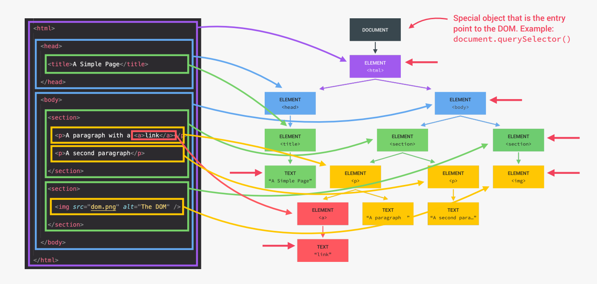

# Manipulação do DOM

## O que é o DOM e o que é manipulação do DOM?

O DOM significa **Document Object Model** que é uma **representação estrutural de documentos HTML**, permitindo que o **javascript acesse e manipule esses elementos.**

# The dom tree structure

A estrutura DOM é representada por uma árvore de elementos html como visto na imagem abaixo.

O DOM sempre inicia com objeto document bem no topo. O document atua como porta de entrada para permitir que o JavaScript acesse esses objetos.

O primeiro child element é o elemento html pois é o elemento "raiz" de todos os elementos html.

Além disso, o html tem dois child elements, sendo head e body.

E conforme vamos avançando, temos mais e mais child elements.

**NOTA:** O DOM não faz parte da linguagem JavaScript. O DOM e DOM Methods fazem parte do que chamamos WEB APIs que são "bibliotecas" implementadas por cada navegador que nos permite utilizar javascript para acessar esses elementos.



# Selecting and Manipulating Elements

```js
// Seleciona uma classe de um elemento HTML.
document.querySelector('.nome-da-classe');
```

No exemplo acima temos que o resultado será todo o elemento HTML que possui a classe passada.

Para acessar o valor do elemento com a classe passada, basta fazer uso da propriedade.textContent

```js
// Retorna o conteúdo do elemento HTML.
console.log(document.querySelector('.nome-da-classe').textContent);
```

Podemos definir o valor do elemento HTML

```js
// Adiciona "Alguma coisa" no elemento HTML.
document.querySelector('.nome-da-classe').textContent = 'Alguma coisa';
```

Para armazenar o valor passado por input utilizamos a propriedade .value

```js
console.log(document.querySelector('.guess').value);
```

Podemos utilizar a propriedade .value para definir um valor para o input.

```js
// O campo do input irá exibir 13.
document.querySelector('.guess').value = 13;
```

# Handling Click Events

Events(eventos) é algo que acontece na página, exemplo quando movemos o mouse, clicamos com o mouse etc. Com um event listener nós podemos esperar que um determinado evento aconteça e em seguida, reagir a ele.

Vamos trabalhar com o botão Check!, quando clicarmos no botão temos que "ouvir" o evento nesse elemento. Ou seja, quando clicarmos no botão alguma coisa tem que acontecer.

```js
// Selecionando o elemento button
document.querySelector('.check').addEventListener('click', () => {
  console.log(document.querySelector('.guess').value);
});
```

.addEventListener() é um método que possui dois parâmetros, primeiro o tipo de evento e o segundo é o que fazer com esse evento caso ele ocorra. Fazemos isso definindo uma função que irá executar quando o o botão for clicado. Chamamos essa função de event handler(Manipulador de eventos).

Ou seja, quando pressionarmos o botão Check! temos que o valor digitado no campo de input será impresso na tela.

Note que não chamamos a função em momento algum, quem chama a função é o mecanismo do JavaScript.

# Manipulating CSS Styles

Para manipular o css no DOM, basta fazer uso de algum seletor como querySelector, seguido da classe, id ou elemento e por fim, passamos a propriedade .style seguido do que queremos modificar, como visto abaixo.

```js
// Modificando a cor de fundo caso o player vença o jogo.
document.querySelector('body').style.backgroundColor = '#60b347';

// Modificando o width da classe number
document.querySelector('.number').style.width = '30rem';
```

Todos os valores são atribuidos como string, além disso usamos a notação camel case para dizer quais propriedades queremos modificar.
